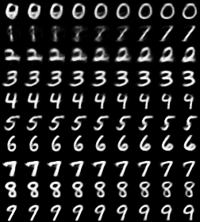
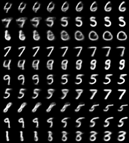

# Variational Autoencoders with PyTorch

A showcase of using VAE to interpolate images in the MNIST dataset.

---

### Similar Pairs interpolation:

---

### Random Pairs interpolation:

---

More about VAE can be learned from here:

source: http://kvfrans.com/variational-autoencoders-explained/